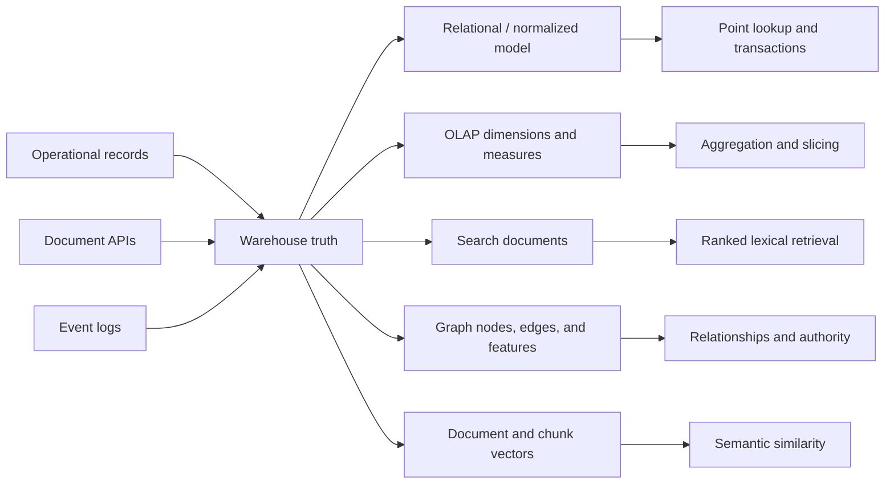
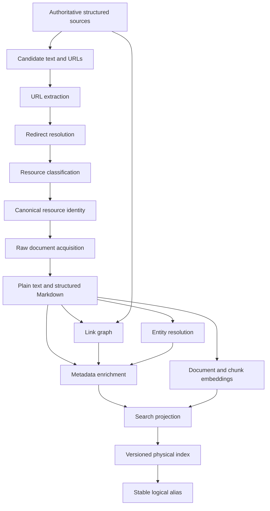
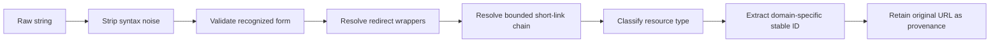
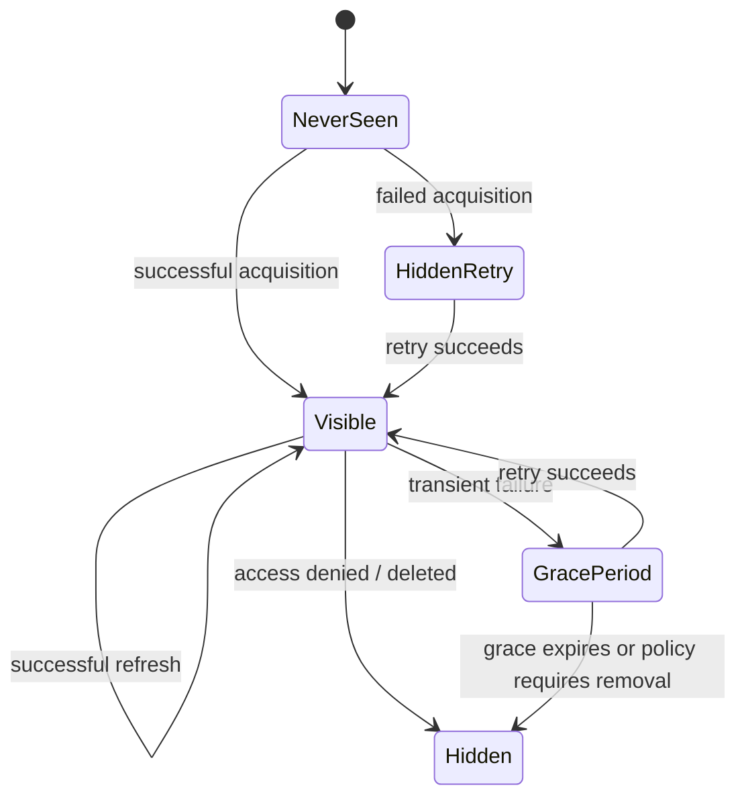
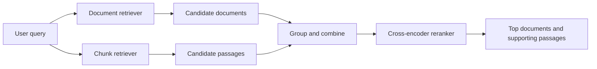
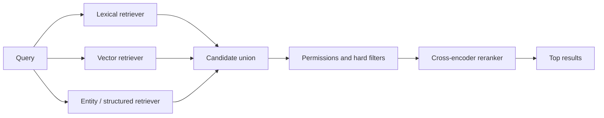
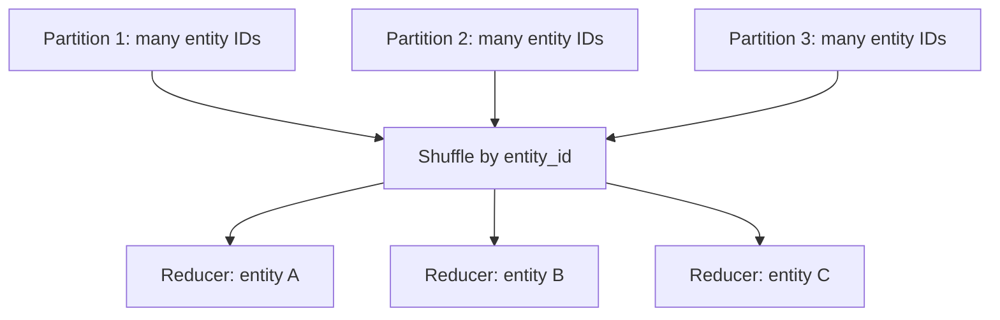

# Reusable Diagrams and Synthetic Examples

Everything in this file is designed to be adapted for public writing without exposing production data or internal identifiers. Diagrams describe the architecture at a conceptual level rather than reproducing exact workflow names.

---

# 1. One source, several serving projections



**Caption idea:** The systems do not disagree about the world; they arrange the same world for different questions.

---

# 2. Corpus construction and indexing pipeline



**Authoring use:** Open a corpus-engineering article by hiding the lower half, then reveal each layer to show why “just index the documents” is misleading.

---

# 3. Versioned index and alias lifecycle

## Before rebuild

```text
logical alias: documents
                    │
                    ▼
physical index: documents_idx_20250301_120000
```

## Build the replacement out of sight

```text
logical alias: documents ─────► documents_idx_20250301_120000  (serving)

                               documents_idx_20250308_120000  (loading)
```

## Atomic alias update

```text
logical alias: documents ─────► documents_idx_20250308_120000  (serving)

                               documents_idx_20250301_120000  (rollback candidate)
```

## Later garbage collection

```text
documents_idx_20250222_120000  → delete if unaliased and outside retention
documents_idx_20250301_120000  → preserve temporarily for rollback
documents_idx_20250308_120000  → active
```

## Public-safe pseudocode

```python
new_index = timestamped_name("documents")

create_index(new_index, mappings=MAPPINGS, settings=INGEST_SETTINGS)
write_snapshot_to_index(snapshot, new_index)
validate_index(new_index, expected=snapshot)
restore_search_settings(new_index)

update_aliases_atomically([
    {"remove": {"alias": "documents", "index": current_index}},
    {"add": {"alias": "documents", "index": new_index}},
])

retain(current_index, reason="rollback")
delete_unaliased_indexes_older_than(retention_window)
```

**Key annotation:** Only the alias update is atomic. Everything around it needs independent retry and validation semantics.

---

# 4. Stable identity after URL canonicalization

## Raw observations

```text
https://docs.example.test/document/d/ABC/edit
https://docs.example.test/document/d/ABC/view?tab=notes
https://drive.example.test/open?id=ABC
https://go.example.test/launch-plan
https://redirect.example.test/?url=https%3A%2F%2Fdocs.example.test%2Fdocument%2Fd%2FABC
```

## Canonical record

```json
{
  "resource_id": "hosted-document:ABC",
  "canonical_url": "https://docs.example.test/document/d/ABC",
  "observed_urls": [
    "https://docs.example.test/document/d/ABC/edit",
    "https://docs.example.test/document/d/ABC/view?tab=notes",
    "https://drive.example.test/open?id=ABC",
    "https://go.example.test/launch-plan"
  ],
  "redirect_chain": [
    "https://go.example.test/launch-plan",
    "https://docs.example.test/document/d/ABC/edit"
  ]
}
```

## Canonicalization stages



## Suggested test table

| Raw input | Expected type | Expected stable ID | Notes |
|---|---|---|---|
| `.../document/d/ABC/edit` | hosted document | `hosted-document:ABC` | remove view suffix |
| `.../document/d/ABC/edit).` | hosted document | `hosted-document:ABC` | remove punctuation |
| `go.example/launch-plan` | short link → hosted document | `hosted-document:ABC` | resolve chain |
| `.../dashboard/workbooks/42/views/7` | dashboard | `dashboard:42` | use workbook identity |
| `.../repo/docs/setup.md` | repository file | full normalized file path | repository ID is too coarse |

---

# 5. Bounded graph discovery


A batch projection can store:

| resource | shortest generation | example path |
|---|---:|---|
| design doc | 0 | source → design doc |
| test report | 1 | source → design doc → test report |
| dashboard guide | 2 | source → design doc → test report → dashboard guide |
| appendix | 3 | source → … → appendix |
| unrelated page | excluded | beyond configured boundary |

## Simple generation-weighted incoming-link score

```text
score(document) = Σ 1 / (1 + generation(linking source))
```

This is not PageRank. It is an interpretable feature saying that links closer to accepted sources contribute more.

---

# 6. Latest attempt versus last successful content



## Recommended state separation

```json
{
  "resource_id": "doc:ABC",
  "latest_attempt": {
    "at": "2025-03-08T12:00:00Z",
    "status": "timeout",
    "error_class": "transient"
  },
  "latest_success": {
    "at": "2025-03-07T12:00:00Z",
    "content_version": "sha256:..."
  },
  "serving_policy": {
    "visible": true,
    "reason": "transient_failure_within_grace_period",
    "reevaluate_at": "2025-03-08T13:00:00Z"
  }
}
```

**Teaching point:** “Latest” should not be one overloaded field.

---

# 7. Tiny inverted-index corpus

Use this corpus for inverted-index, BM25, precision/recall, and field-weighting posts.

| ID | Title | Body | Type |
|---|---|---|---|
| D1 | Mercury Launch Plan | Timeline and owners for Project Mercury. | plan |
| D2 | Planetary Review | Mercury is the closest planet to the Sun. | research |
| D3 | Chemical Safety | Procedures for mercury exposure. | manual |
| D4 | Launch Retrospective | What we learned after Project Mercury launched. | report |
| D5 | Venus Launch Plan | Timeline and owners for Project Venus. | plan |
| D6 | Project Index | Links to Mercury and Venus project materials. | index |

## Simplified postings for `mercury`

```text
mercury →
  D1: title=1, body=1
  D2: title=0, body=1
  D3: title=0, body=1
  D4: title=0, body=1
  D6: title=0, body=1
```

Questions this corpus supports:

- Why should D1 rank above D2 for “Mercury launch plan”?
- When should D3 be included for the one-word query “mercury”?
- Would a project-type filter help precision?
- Should D6's link authority compensate for its weak text?
- How does a title field differ from body text?
- What would a vector retrieve for “project rollout schedule” when the exact word *launch* is absent?

---

# 8. `text`, `keyword`, and `nested` examples

## Multi-field title

```json
{
  "mappings": {
    "properties": {
      "title": {
        "type": "text",
        "analyzer": "english",
        "fields": {
          "exact": {
            "type": "keyword",
            "normalizer": "lowercase"
          }
        }
      }
    }
  }
}
```

Possible questions:

- `title`: which documents are relevant to *launch planning*?
- `title.exact`: which documents have exactly the normalized title *mercury launch plan*?

## Why an object array may need `nested`

Source document:

```json
{
  "entities": [
    {"id": "project-mercury", "score": 2},
    {"id": "planet-mercury", "score": 99}
  ]
}
```

An ordinary object mapping can flatten values conceptually into:

```text
entities.id    = [project-mercury, planet-mercury]
entities.score = [2, 99]
```

A query for `id=project-mercury AND score>=90` can falsely match. A nested mapping keeps each ID associated with its score.

---

# 9. Deterministic entity-resolution example

## Entity dictionary

| entity ID | canonical name | aliases | case policy |
|---|---|---|---|
| project-mercury | Project Mercury | Mercury Program | insensitive phrase |
| planet-mercury | Mercury | planet Mercury | context-sensitive |
| element-mercury | mercury | Hg | lowercase/body-sensitive |

## Evidence model

```text
title match                 × 20
curated project field       × 10
body match                  × 1
exact stable identifier     + strong deterministic evidence
rare phrase                 × higher specificity
common phrase               × lower specificity
explicit exclusion          → remove candidate
```

## Trie behavior to demonstrate

Input:

```text
The Project Mercury launch report mentions mercury exposure controls.
```

Desired observations:

- match `Project Mercury` as a whole phrase;
- do not match a phrase inside a larger alphanumeric word;
- allow the lowercase body occurrence to remain a candidate for the chemical element;
- keep field and character-span provenance for later scoring;
- do not force one global decision before gathering all evidence.

## Suggested result structure

```json
[
  {
    "entity_id": "project-mercury",
    "evidence": [
      {"field": "title", "phrase": "Project Mercury", "weight": 20}
    ]
  },
  {
    "entity_id": "element-mercury",
    "evidence": [
      {"field": "body", "phrase": "mercury", "weight": 1}
    ]
  }
]
```

---

# 10. Structure-aware chunking example

## Input Markdown

```markdown
# Project Mercury

## Experiment Results

The new signup flow increased completion by 17%.

### Mobile

The effect was strongest on small screens.

### Television

No statistically meaningful change was observed.

## Guardrail Metrics

<table>
<thead><th>Metric</th><th>Change</th></thead>
<tr><td>Error rate</td><td>+0.1%</td></tr>
<tr><td>Latency</td><td>-12 ms</td></tr>
</table>
```

## Poor fixed-window chunk

```text
...increased completion by 17%. Mobile The effect was strongest on small screens. Television No statistically...
```

It loses the document and section relationship.

## Better chunks

```text
# Project Mercury
## Experiment Results
The new signup flow increased completion by 17%.
```

```text
# Project Mercury
## Experiment Results
### Mobile
The effect was strongest on small screens.
```

```text
# Project Mercury
## Guardrail Metrics
| Metric     | Change |
| Error rate | +0.1%  |
| Latency    | -12 ms |
```

Each chunk should retain:

```json
{
  "document_id": "project-mercury-results",
  "chunk_number": 2,
  "section_path": ["Project Mercury", "Guardrail Metrics"],
  "content_version": "sha256:...",
  "text": "..."
}
```

---

# 11. Document-level and chunk-level retrieval



Possible strategy:

1. retrieve documents for corpus-level coherence;
2. retrieve chunks for passage recall;
3. union by stable document ID;
4. rerank bounded query/passage pairs;
5. group passages under documents;
6. apply permissions and provenance checks;
7. pass selected evidence to an answer generator.

This is an illustrative architecture, not a claim about the exact production request path.

---

# 12. Hybrid retrieval score warning

Example result lists:

```text
Lexical ranking: D1, D4, D6, D5
Vector ranking:  D4, D1, D5, D2
```

Do not casually add raw scores:

```text
BM25 score:   12.7
cosine score:  0.83
```

They are not calibrated units. A simple public-safe fusion example is reciprocal-rank fusion:

```text
RRF(document) = Σ 1 / (k + rank_in_retriever)
```

For `k=60`, both result lists contribute comparable rank evidence without pretending score magnitudes are equivalent.

---

# 13. Candidate generation and reranking



Teaching distinctions:

- retrievers optimize recall under strict latency;
- filters enforce eligibility;
- the reranker optimizes precision over a bounded set;
- fallback can skip the reranker while retaining usable retrieval;
- stage-specific evaluation identifies where a result was lost.

---

# 14. The shuffle-tax illustration

## Logical transformation

```sql
SELECT entity_id, COUNT(DISTINCT document_id)
FROM document_entity_mentions
GROUP BY entity_id;
```

## Physical consequence



If entity A appears in half the corpus, E1 becomes a straggler even if the average partition is small.

## Collect-and-broadcast contrast

When the entity dictionary is small:

```text
small entity dictionary → collect once → broadcast to every executor
large document corpus    → remains partitioned → local trie matching
```

Decision question:

> Can the broadcast side be bounded by an explicit invariant, or are we merely hoping it stays small?

---

# 15. OLAP and search as sibling projections

| Concern | OLAP projection | Search projection |
|---|---|---|
| Primary question | aggregate and slice | retrieve and rank |
| Main build artifact | segments/cubes/rollups | inverted index/vector graph |
| Typical schema | dimensions and measures | fields, analyzers, mappings, vectors |
| Expensive precomputation | aggregation/sketches | tokenization/enrichment/embeddings |
| Serving objective | interactive analytical latency | interactive top-k latency |
| Update pattern | partition/segment replacement | index rebuild or document mutation |
| Approximation | sketches, rollups | approximate nearest neighbors, candidate pruning |
| Common failure | wrong grain or stale partition | wrong identity, mapping, corpus, or ranking |

**Teaching point:** Both systems create an intentionally redundant representation so the serving request does less work.

---

# 16. Approximation versus semantic grain

Suppose a team wants the median watch time.

Possible observations:

```text
A. one observation per playback session
B. one observation per account per day
C. one observation per account over 28 days
D. one observation per title per account
```

A quantile sketch can approximate each distribution accurately, but they answer different questions. The article should ask “a sketch of what?” before discussing compression or error bounds.

---

# 17. Article decision checklist graphics

## Is a search projection justified?

```text
Do users need ranked retrieval over imperfect matches?
  ├── no → use ordinary database/query tools
  └── yes
      Can the source answer within the latency budget?
        ├── yes → consider whether another system is necessary
        └── no
            Can the projection be rebuilt and validated?
              ├── no → define source/consistency contract first
              └── yes → build a search projection
```

## Should this happen at index time?

```text
Is the value expensive to compute per request?
Is it shared by many queries?
Can some staleness be tolerated?
Can it be recomputed from canonical sources?
Does denormalizing it avoid an unavailable join?
```

More “yes” answers favor index-time enrichment.

## Should a dictionary be broadcast?

```text
Is it bounded?
Does it fit comfortably in driver and executor memory?
Is it reused for many input records?
Does broadcasting avoid a large shuffle?
Can its version be tracked?
```

---

# 18. Public-safe naming scheme

Use these consistently across posts so examples feel like one evolving system:

- **Product:** “Atlas,” a fictional enterprise discovery system
- **Warehouse schema:** `atlas`
- **Logical index aliases:** `atlas.documents`, `atlas.entities`, `atlas.topics`
- **Physical index:** `atlas.documents_idx_20250308_120000`
- **Document API:** `docs.example.test`
- **Short links:** `go.example.test/...`
- **Dashboard system:** `dashboards.example.test`
- **Entity examples:** projects, countries, products, employees, and public media titles
- **Authoritative sources:** project catalog, experiment registry, curated topic pages
- **Discussion source:** team Q&A threads

A consistent fictional system allows later posts to build on earlier diagrams without revealing internal product names.
