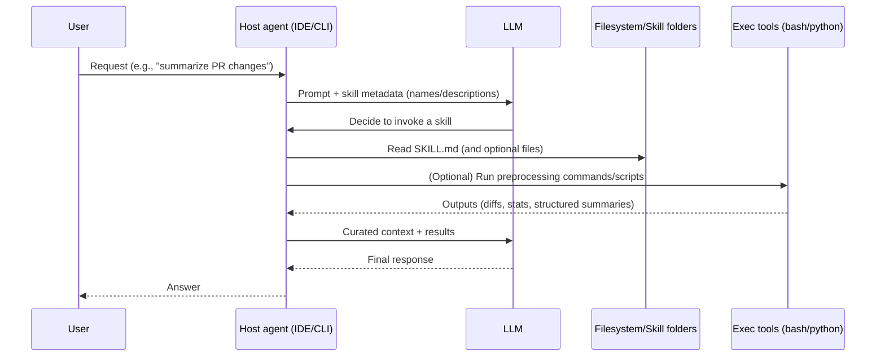
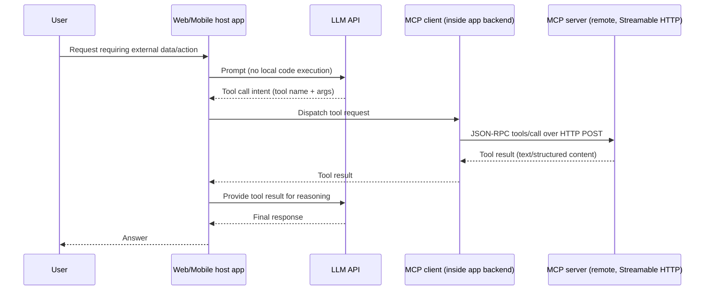

# Skills vs MCP for AI Tool Integration

## Background and terminology

“Skills” (as implemented in tools like entity["organization","Claude Code","anthropic coding agent"] and in the entity["company","Cursor","ai code editor"] ecosystem) are **packaged, reusable agent behaviors**: a folder that contains a required `SKILL.md` plus optional scripts/resources that the agent can read and execute as needed. In Claude’s own materials, skills are explicitly described as folders containing instructions and optional executable code (for example Python or Bash), with **progressive disclosure** so only lightweight metadata is loaded up front and richer content is pulled in when relevant. citeturn12view0turn13view2turn3view2

“MCP” (Model Context Protocol) is an **open protocol** for connecting an LLM application to external tools and context sources. The MCP spec defines a client/server architecture using JSON-RPC 2.0, with a lifecycle handshake, capability negotiation, and standardized primitives (notably **tools**, **resources**, and **prompts**). citeturn3view5turn8view1turn14view2

A practical way to summarize the difference—consistent with Anthropic’s own skills guidance—is:

- **Skills = “how to do it well” (procedures, best practices, repeatable workflows)**
- **MCP = “how to connect” (tools + data access + structured invocation surface)** citeturn12view1turn12view0turn13view2turn3view1

This framing matters because it maps directly to the user’s core architectural contrast:

- **Skills generally assume a code-execution-capable host environment** (filesystem + shell/tool access), which is why skills are so effective in coding agents and sandboxes. citeturn13view2turn5search0turn5search1  
- **MCP does not inherently require “embedded code execution” in the host**; it requires a host that can speak MCP transports (stdio or Streamable HTTP in the current spec), translate tool calls, and manage auth/trust boundaries. citeturn8view0turn3view5turn9view0

## Execution model comparison and where each “lives”

The most important engineering difference for tool integrators is **where computation and authority sits**.

Skills in Claude’s ecosystem are explicitly “filesystem-based” and tied to a VM/sandbox model: skills exist as directories on a filesystem, and Claude loads/reads them via tools (for example “via bash” in Anthropic’s Agent Skills overview). Using skills via the Claude API is even more explicit: skills run in a code-execution container and require enabling the code execution tool plus beta headers. citeturn13view2turn5search15

MCP, in contrast, standardizes a boundary: the **MCP server** performs the privileged action (call an API, run a computation, read a dataset), and the **MCP client** inside the host routes requests/responses using MCP semantics and transports. MCP’s security docs treat the server side as potentially powerful and dangerous—especially for local servers—and emphasize consent, sandboxing local servers, and careful boundary enforcement. citeturn3view5turn9view0turn8view0

The table below highlights capability differences that follow from those execution models (synthesized from official Claude skills docs/guides and the MCP spec/security guidance). citeturn13view2turn12view0turn3view2turn8view0turn9view0turn3view5

| Dimension | Skills (Claude Code/Cursor style) | MCP (official spec + ecosystem) |
|---|---|---|
| Primary purpose | Package **procedural knowledge + optional scripts/resources**; teach repeatable workflows | Package **connectivity + structured tool/data primitives** across apps |
| Assumed host capabilities | Typically assumes **filesystem + tool access + code/shell execution** (VM/sandbox) | Assumes host can run an MCP client and reach servers via **stdio or Streamable HTTP**; no intrinsic need for a “code interpreter” |
| Where “actions” execute | Often in the **host runtime** (shell commands, bundled scripts, file ops) | In the **MCP server process/service**, which may be local or remote |
| Cross-app portability | Skills format is intended to be reusable across “surfaces,” but depends on environment dependencies being present (and in practice, per-surface differences exist) citeturn12view0turn13view2 | MCP is explicitly designed as an interoperability layer (host/client/server separation + standard primitives) citeturn3view5turn8view1 |
| Best fit | “Do work on/near the machine” (codebases, local artifacts, automation) | “Connect the agent to systems” (APIs, SaaS, internal services, remote context) |
| Biggest risk | Running untrusted instructions/code inside a powerful environment | Trusting unvetted servers/tool metadata; auth misconfig; proxy confused-deputy patterns; local server compromise |

A useful expert perspective comes from entity["people","Simon Willison","software developer blogger"]: he argues that the *skills mechanism depends on having a coding environment* (filesystem + navigation tools + command execution), which is exactly why it’s compelling inside CLI/IDE agents—but also why it is structurally different from MCP. citeturn5search0

## Architecture patterns for MCP clients without embedded code execution

MCP’s design makes it feasible to build MCP clients in places where you *do not* want (or cannot safely offer) LLM-driven code execution—like a web app, mobile app, or locked-down enterprise service.

### Streamable HTTP clients for web, mobile, and serverless

The current MCP spec defines two standard transports: **stdio** and **Streamable HTTP**. Streamable HTTP is explicitly HTTP POST/GET-based (optionally with SSE for streaming server messages), supports multiple connections and resumability, and includes specific security requirements like Origin validation. citeturn8view0

Because Streamable HTTP is “just HTTP,” an MCP client can be implemented as:

- a web backend (API server) that brokers between the LLM provider and MCP servers,
- a mobile app that speaks HTTP to a remote MCP server,
- a serverless function that performs short-lived tool calls (with careful session handling where needed).

This is an inference from the transport design (HTTP primitives + JSON-RPC), not a guarantee of “drop-in” compatibility for every MCP server (for example, servers may require long-lived sessions or streaming). The protocol still provides explicit guidance on session management and resumability for Streamable HTTP. citeturn8view0turn8view1

### Proxy servers as “MCP gateways” for enterprise boundaries

The MCP security best practices document discusses **MCP proxy servers** explicitly—servers that sit between MCP clients and third-party APIs—and warns about “confused deputy” vulnerabilities if consent and client identity are mishandled. citeturn9view0

This gives you a first-class architecture pattern:

- Put an **MCP gateway** in your controlled environment.
- The LLM host never gets raw credentials.
- The gateway handles OAuth flows, scope minimization, audit logging, policy enforcement, and transformation of tool outputs.

This pattern is especially relevant when the host is a web UI that you do not want to endow with local code execution.

### Browser-native MCP clients with no local install (unreleased / proposed)

A particularly strong example of “MCP without embedded code execution” is the proposed **postMessage transport**. The proposal’s explicit goal is “secure, direct, browser-native communication without software installation,” by running the MCP server inside an iframe and using `window.postMessage` for MCP message exchange. It highlights benefits like browser sandboxing, origin checks, and direct access to browser APIs (File System Access API, WebAssembly, Web Bluetooth, etc.). citeturn23view0

This matters for tool integrators because it’s a credible path to:

- MCP clients implemented entirely in the browser (or a browser extension),
- local-data workflows without installing native binaries,
- fine-grained permission UX aligned with browser security primitives.

It is **not in the core spec** today; treat it as an “MCP 2.0 era” ecosystem direction (proposal status) and plan for compatibility fallbacks. citeturn23view0turn8view0

### Embedded UI surfaces via MCP Apps (extension track)

The MCP ecosystem is also expanding beyond “tools return text/JSON” via the **MCP Apps extension** (in the official `ext-apps` repository). Its README describes a standard where tools can declare `ui://` resources, hosts render UIs in a sandboxed iframe, and the UI can communicate bidirectionally (including calling other tools through the host). citeturn18view1turn19view0

For “clients outside a sandbox,” this is a major architectural unlock: you can build a web host that does **not** execute arbitrary code, but can still render interactive tool experiences safely.

## Practical examples and case studies

### Claude Code: combining Skills, MCP servers, and governance controls

Claude Code’s documentation shows both sides:

- **Skills**: Create a `SKILL.md`, invoke via `/skill-name`, control invocation via frontmatter, restrict tool access via `allowed-tools`, and even inject dynamic context by running shell commands before the skill content is sent to the model (e.g., `!`command` placeholders). citeturn3view2turn10view1turn10view0  
- **MCP**: Connect to remote HTTP servers (example includes connecting to Notion), warn that third-party MCP servers are unverified and can introduce prompt-injection risk, and provide enterprise governance patterns like `managed-mcp.json` plus allowlists/denylists. citeturn25view2turn25view0turn25view3

This is a clean case study of **how the same host supports both paradigms**: skills for workflow guidance and local automation, MCP for external-system connectivity and tool invocation, and governance controls around what MCP servers can be used.

### Claude’s “tool search” response to MCP context bloat

A widely observed MCP pain point is “tool schema bloat” consuming context. Anthropic’s engineering writeup on advanced tool use quantifies this and introduces the “Tool Search Tool” approach, where tools are deferred and discovered on demand, preserving context and improving tool selection accuracy in internal testing. citeturn3view0

Claude Code’s MCP docs and the Claude Agent SDK MCP docs describe the productized version: **MCP Tool Search** activates automatically when MCP tool descriptions exceed a threshold (10% of context), marks tools as deferred, then uses a search tool to load only relevant tool definitions. citeturn3view1turn3view4

This is important for the “skills vs MCP” decision because it shows the ecosystem converging on a similar principle:

- Skills minimize token load through progressive disclosure of instructions/resources. citeturn12view0turn13view2  
- MCP minimizes token load through progressive disclosure of tool definitions (tool search / deferred loading). citeturn3view0turn3view4turn3view1

### Cursor: skills adoption and MCP operational reality

Cursor’s recent releases and community posts indicate active adoption of “skills” as a first-class concept—skills that can include instructions/scripts and can be auto-invoked or run as commands (as described in their release notes and forum announcements). citeturn0search18turn0search28

At the same time, Cursor’s community forums provide an unvarnished operational reality of MCP integration: users report agents failing to discover MCP tools even when servers appear connected, along with workarounds like explicitly asking the agent to list MCP tools to “bootstrap” discovery for a session. citeturn6search17turn6search7

Why include this in an architectural report? Because it highlights a key practical trade-off:

- MCP gives you a standardized protocol surface, but **host implementations vary in completeness and reliability**, especially for non-tool primitives (resources/prompts) and for discovery/indexing behavior. citeturn6search4turn6search17turn3view5  
- Skills can sometimes provide more deterministic “in-host” behavior (because they’re essentially packaged instructions + code in the same runtime), but at the cost of requiring execution capability and creating a larger local attack surface. citeturn13view2turn5search0

### Security incidents and ecosystem research as “governance case studies”

The MCP ecosystem has had real-world security lessons. entity["company","Tenable","cybersecurity company"] published an analysis of a critical vulnerability affecting Anthropic’s MCP Inspector tool (a core MCP ecosystem dev tool), underscoring that the tooling around MCP becomes part of the security perimeter. citeturn2search18

Academic/security research has also started to systematically analyze MCP host/registry/server trust relationships, registries at scale, and risks like server hijacking and induced behaviors. citeturn6academia37

For tool integrators, the lesson is not “avoid MCP,” but “treat tool ecosystems like package ecosystems”: provenance, auditability, and policy controls become essential as adoption scales.

## Trade-offs for tool integrators

### Security and trust boundaries

Skills and MCP concentrate risk differently.

Skills concentrate risk **inside the host runtime**. Anthropic’s Agent Skills docs explicitly warn to use skills only from trusted sources because malicious skills can direct tool invocation or execute code in unintended ways. citeturn13view2turn12view0 Claude Code also provides OS-level sandboxing modes for bash, reinforcing that command execution is powerful enough to require isolation tooling. citeturn5search1turn5search22

MCP concentrates risk **at integration boundaries**: untrusted MCP servers, untrusted tool metadata, DNS rebinding risks for local servers, and proxy-server OAuth pitfalls. The Streamable HTTP transport requires Origin validation, and the MCP security best practices document goes deep on confused deputy risks, SSRF in OAuth discovery, and local server compromise, including the need for consent and sandboxing. citeturn8view0turn9view0

A key design choice emerges:

- If you can’t guarantee a hardened execution environment, **prefer “remote execution behind a protocol boundary”** (MCP servers + strict auth/policy).  
- If your primary tasks are local and you *can* sandbox effectively, **skills unlock powerful automation with minimal integration work**. citeturn9view0turn13view2turn5search1

### Authentication and authorization

MCP has a much more explicit, protocol-level path for auth—especially for remote servers.

- The MCP authorization spec is optional overall, but when used it is defined at the transport level for HTTP-based transports; for stdio servers, the spec explicitly says implementations should not follow the HTTP auth spec and should retrieve credentials from environment/config instead. citeturn8view2turn8view0  
- The “draft” authorization spec (and later stable revisions) are aligned with OAuth 2.1 direction and include Protected Resource Metadata (RFC 9728) and multi-step discovery. citeturn14view1turn9view0

Skills have no protocol-level auth story by themselves; they inherit whatever auth mechanisms exist in the host environment (CLI tools, environment variables, secrets managers, etc.). Anthropic’s own “Skills + MCP” positioning effectively assumes MCP is how you do secure connectivity, and skills are how you teach best practices on top of it. citeturn12view0turn12view1turn25view2

### Latency and interaction cost

Skills often reduce “round trips” in practice by letting the agent run scripts/commands locally, batch work, and preprocess context before invoking the model with a more compact, curated prompt. Claude Code’s pre-execution `!`command` pattern is explicitly “preprocessing, not something Claude executes,” reducing useless context and giving the model exactly the needed data. citeturn10view0turn13view2

MCP adds network overhead for remote servers, but Streamable HTTP explicitly supports streaming and resumable polling behavior. Whether MCP is “slower” depends on your architecture: a remote MCP server that returns a small structured payload can be far cheaper than running large local scripts and shipping their output into context. citeturn8view0turn3view0turn9view0

### Context usage and scaling

Skills are designed around progressive disclosure: metadata always loaded; instructions loaded when triggered; additional files loaded as needed. citeturn12view0turn13view2

MCP historically forced “load all tool schemas upfront” in many hosts, creating large context tax. Anthropic’s Tool Search approach—and Claude Code/Agent SDK’s MCP Tool Search—represent the ecosystem correction: defer tool definitions and discover them on demand. citeturn3view0turn3view4turn3view1

The takeaway for developers is that **context economics is no longer a decisive “skills win” by default**. With tool search, MCP can scale to large tool catalogs without consuming the whole context window—assuming your host supports deferred loading and tool reference expansion. citeturn3view0turn3view4turn3view1

### Governance and enterprise controls

Claude Code provides a strong example of enterprise governance patterns around MCP: system-wide `managed-mcp.json` to enforce an immutable set of servers, plus allowlists/denylists to permit user customization under policy constraints. citeturn25view0turn25view1

The MCP ecosystem itself is also formalizing governance via an extensions framework (SEP-2133), with official extensions housed under the MCP org and negotiated via capabilities. citeturn19view0turn14view1

Skills governance is comparatively “content governance”: version control, code review, distribution channels/marketplaces, and trust in skill authors. Anthropic’s docs emphasize “trusted sources,” but do not provide a protocol-level provenance mechanism for skills today. citeturn13view2turn12view0

## MCP 2.0 unreleased features and what they imply for “Skills vs MCP”

“MCP 2.0” is not currently a single official label in the MCP spec (which uses date-based protocol revisions). citeturn3view5turn8view1 In practice, “MCP 2.0” is commonly used in the community to refer to major post-2025 authorization/elicitation/task-era changes and upcoming ecosystem additions (for example, community discussions explicitly referencing “possible inclusion in MCP 2.0”). citeturn24search3turn22view0

From a tool integrator’s perspective, the important “MCP 2.0 direction” themes are:

### Browser-native and embedded experiences

- **postMessage transport (proposal):** Enables MCP entirely within the browser via iframes and `window.postMessage`, with explicit benefits around “zero installation servers” and browser sandbox privacy/security. citeturn23view0  
- **MCP Apps extension (official extension track):** Standardizes interactive UIs rendered inline in hosts via sandboxed iframes, with bidirectional communication and UI resources declared by tools. citeturn18view1turn19view0

Implication: MCP is expanding from “tool calling” toward “tool experiences,” which reduces one advantage skills historically had (rich in-host workflows/UI patterns).

### Security provenance and supply-chain hardening

- **Tool Bill of Materials (TBOM) proposal:** A signed manifest binding tool metadata digests, artifact digests, publisher identity, and SBOM references—explicitly motivated by scale (“10,000+ MCP servers”) and the need to know who published a server and whether tool metadata drifted since review. citeturn21view0

Implication: if TBOM-like mechanisms mature, MCP could gain a stronger “enterprise-grade provenance” story than skills content distribution alone.

### Headless and constrained clients

- **Non-interactive OAuth flows (proposal):** Extends MCP client behavior to support Device Authorization Grant (RFC 8628) and CIBA for headless / limited-input MCP clients that can’t launch a browser for PKCE flows. citeturn22view0turn14view1

Implication: MCP’s “no embedded code execution” story gets stronger as auth becomes more workable for cron jobs, background agents, and IoT-style clients.

### Skills and memory as first-class protocol concerns (proposals)

- **Agent Skills as an MCP primitive (proposal):** Introduces `skills/list`, `skills/get`, a skills capability, skill metadata/dependencies, and progressive disclosure—explicitly mapping to the SKILL.md standard so MCP servers could distribute skills in a portable way. citeturn21view1  
- **Memory portability tools (proposal):** Suggests standard MCP tools like `export_memory` and `import_memory` to address user data ownership and portability motivations (explicitly referencing GDPR portability). citeturn22view1

Implication: the boundary between “skills vs MCP” may blur. MCP could become a transport/distribution mechanism for skills-like content, while skills remain the behavioral packaging unit.

## Recommendations for developers deciding what to use

The most robust strategy for AI tool integrators is **not** “pick one,” but “pick a primary control plane” and use the other as a complement.

### When Skills should be your primary mechanism

Skills are the right primary choice when:

- Your agent must do work in a **code-execution-centric environment** (repo refactors, local automation, artifact generation) and you can sandbox/permission it appropriately. citeturn13view2turn5search1turn5search0  
- The capability you need can be achieved with **local scripts + existing CLIs** without building/operating a server fleet. (This is also the pattern Simon Willison highlights as a common modern agent approach.) citeturn5search0turn5search13  
- You need to encode **workflow expertise** (checklists, conventions, “do it this way here”) more than you need a stable remote API integration surface. citeturn12view1turn10view0turn13view3

In this mode, MCP is still useful—but as a “secure connector” for the subset of operations that require authenticated external systems.

### When MCP should be your primary mechanism

MCP should be your default when:

- Your product must support **tool use outside a sandbox** (web app, mobile app, locked-down enterprise host) where you cannot safely offer arbitrary code execution. MCP’s Streamable HTTP transport and security model are built for this kind of separation. citeturn8view0turn9view0  
- You need **interoperability across multiple hosts** (agents/IDEs/chat clients), and you want to ship one “tool server” integration rather than rewriting tool-calling glue for every platform. citeturn3view5turn8view1  
- You have serious auth/governance needs: OAuth-based remote servers, least-privilege scopes, policy enforcement, centralized allowlists/denylists, auditable server config. citeturn8view2turn9view0turn25view0

In this mode, skills become the “knowledge layer” that makes your MCP server usable and reliable.

### A practical hybrid pattern: MCP for capability, Skills for reliability

Anthropic’s own skills guide explicitly recommends a combined perspective for MCP builders: if you already have a working MCP server, skills are the knowledge layer that captures workflows and best practices so the model applies them consistently. citeturn12view0turn12view1

A strong general recommendation for tool integrators is:

- Build an MCP server for **capability** (auth + API capture + structured tool schemas).
- Ship a skill for **how to use it well** (when to call which tool, common parameter patterns, error-handling playbooks, “golden paths,” and local preprocessing to reduce context/latency). citeturn12view1turn3view1turn13view3

### Decision checklist

Use this checklist as a “first principles” decision tool (grounded in Claude skills docs and MCP transport/security requirements). citeturn13view2turn12view0turn8view0turn9view0turn25view0

- **Is your host allowed to execute LLM-driven code?**  
  If no → MCP-first. If yes → skills may be viable.
- **Does the value depend on local artifacts (repo/files) and shell tooling?**  
  If yes → skills-first, possibly with MCP for external systems.
- **Do you need cross-client interoperability (Claude Code + Cursor + other hosts)?**  
  If yes → MCP-first for the integration surface, skills as optional UX/reliability layer.
- **Is auth a first-class requirement (OAuth, SSO, scoped enterprise access)?**  
  If yes → MCP-first. Skills can describe workflows but don’t standardize auth.
- **Will you expose many tools (10+ to 100+)?**  
  If yes → plan for MCP Tool Search / deferred loading (host-dependent) and/or use skills to keep workflows compact. citeturn3view0turn3view4turn12view0
- **Do you need interactive UI rendered in the host (forms, charts, rich widgets)?**  
  Consider MCP Apps extension direction; if you can’t rely on that host support yet, skills may still be the practical “today” option. citeturn18view1turn19view0
- **Are you operating at scale where supply chain provenance matters?**  
  MCP is developing explicit provenance proposals like TBOM; for now, either way you need a software-supply-chain discipline. citeturn21view0turn6academia37

## Reference flows and starter diagrams

### Flow: Skills in a sandboxed coding agent



This reflects Claude’s documented progressive disclosure model (metadata → SKILL.md → additional resources/scripts) and Claude Code’s ability to run shell preprocessing before the model sees the final prompt. citeturn13view2turn12view0turn10view0

### Flow: MCP client outside a code-execution environment



This is directly enabled by MCP’s Streamable HTTP transport definition and the tools/list + tools/call pattern. citeturn8view0turn14view2turn3view5

### Minimal “raw MCP over HTTP” sketch

Below is a conceptual example of the JSON-RPC payload shape used by MCP tools calls (the exact endpoint/session headers depend on the server and negotiated protocol version): citeturn8view0turn14view2turn8view1

```json
{
  "jsonrpc": "2.0",
  "id": 42,
  "method": "tools/call",
  "params": {
    "name": "get_weather",
    "arguments": { "location": "New York" }
  }
}
```

### Flow: Browser-native MCP (proposed postMessage transport)

If you are planning for “MCP clients without code execution” that still need local/user data, the postMessage transport proposal is a forward-looking blueprint:

- MCP server runs in a sandboxed iframe.
- Host communicates via `window.postMessage`.
- Origin/source checks become core security gates.
- No native install required. citeturn23view0

That proposal is detailed enough to treat as an implementable reference design, but it is not currently part of the core spec—so it should be approached as an experimental “MCP 2.0 direction,” not a guaranteed interoperability baseline. citeturn23view0turn8view0